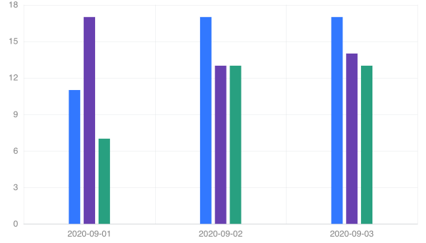

# smart-chart

> Angular4 charts use with d3.js

## Example

### BarChart



## Installition

```bash
npm i -S SmartChart
```

```ts
import { TreeChart, PieChart, LineChart, BarChart} from 'SmartChart'
```

```ts
const config = {};
const treeChart = new TreeChart(config);
```

## Tools

- webpack use it for dev
- rollup use it for prod
- gulp use it for stream build
