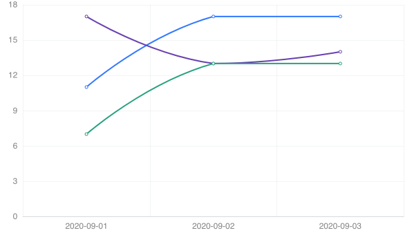
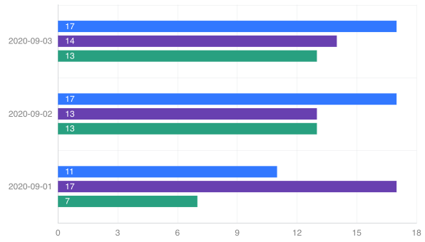
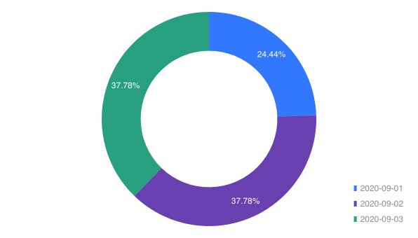

# smart-chart

> A chart library comprises other charts like echarts, d3 etc.

 [](http://makeapullrequest.com)  [](https://badge.fury.io/gh/TaylorPzreal%2Fsmart-chart)
[](https://badge.fury.io/js/smart-chart)

> Note that the smart-chart dependent ```echarts```, you should install it separately.

## Installition

```bash
npm i -S smart-chart
```

## Usage

A common chart that you can switch chart type: line, bar, horizontal bar, pie. You just need one data structure.

```ts
import { Chart, XConfiguration, XChartType, XDataSerial } from 'smart-chart';

const chart = new Chart(document.getElementById('chart') as HTMLDivElement);

function changeChartType() {
  const types = Object.values(XChartType);
  const type = types[this.nextType++ % types.length];

  const configuration: XConfiguration = {
    type,
    serials: [
      {
        name: 'item1',
        data: [['2020-09-01', 11], ['2020-09-02', 17], ['2020-09-03', 17]],
      },
      {
        name: 'item2',
        data: [['2020-09-01', 17], ['2020-09-02', 13], ['2020-09-03', 14]],
      },
      {
        name: 'item3',
        data: [['2020-09-01', 7], ['2020-09-02', 13], ['2020-09-03', 13]],
      }
    ],
  };
  chart.render(configuration);
}
```

```ts
```

### Or use it in JS

```html
<script src="path/to/dist/index.js"></script>
```

```js
const chart = new SmartChart.Chart(document.getElementById('chart'));
```

## Examples





